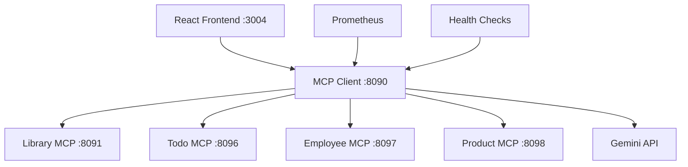

# MCP Monkeys - Spring AI 기반 통합 MCP 플랫폼

> **Model Context Protocol (MCP)** 아키텍처로 구현된 차세대 AI 통합 서비스 플랫폼
> **Spring AI 2.0.0-M1** + **Spring Boot 4.0.1** 최신 기술 스택 적용

[](https://spring.io/projects/spring-ai)
[](https://kotlinlang.org/)
[](https://spring.io/projects/spring-boot)

## 프로젝트 개요

MCP Monkeys는 **Model Context Protocol (MCP)** 아키텍처를 기반으로 한 통합 AI 서비스 플랫폼입니다. Spring AI 2.0.0-M1과 Spring Boot 4.0.1의 최신 기능들을 활용하여 구조화된 출력, 관찰 가능성, 그리고 확장 가능한 마이크로서비스 아키텍처를 제공합니다.

### 핵심 특징

- **MCP 아키텍처**: 각 도메인을 독립적인 MCP 서버로 분리
- **자체 데이터베이스**: H2 인메모리 DB로 외부 API 의존성 제거
- **Spring AI 2.0**: @Tool/@ToolParam 어노테이션 기반 도구 정의
- **Kotest + Fixture Monkey**: 최신 테스트 프레임워크 적용
- **JPA + Kotlin JDSL**: 타입 안전한 쿼리 작성
- **실시간 모니터링**: Prometheus 메트릭, OpenTelemetry 추적

## 아키텍처



### 서비스 구성

| 서비스 | 포트 | 역할 | 데이터베이스 |
|--------|------|------|-------------|
| **MCP Client** | 8090 | 통합 관리자 + AI 인터페이스 | - |
| **Library Server** | 8091 | 도서관리 서비스 | H2 |
| **Todo Server** | 8096 | 할일관리 서비스 | H2 |
| **Employee Server** | 8097 | 직원관리 서비스 | H2 |
| **Product Server** | 8098 | 상품관리 서비스 | H2 |
| **React Frontend** | 3004 | 사용자 인터페이스 | - |

## 빠른 시작

### 1. 환경 설정

```bash
# Google Cloud 설정 (Gemini API 사용 시)
export GOOGLE_CLOUD_PROJECT="your-project-id"
export GOOGLE_CLOUD_LOCATION="asia-northeast1"
```

### 2. 서버 실행

```bash
# 전체 MCP 서버 동시 시작
./gradlew :mcp-library-server:bootRun --args='--server.port=8091' &
./gradlew :mcp-todo-server:bootRun --args='--server.port=8096' &
./gradlew :mcp-employee-server:bootRun --args='--server.port=8097' &
./gradlew :mcp-product-server:bootRun --args='--server.port=8098' &

# 통합 클라이언트 실행
./gradlew :mcp-client:bootRun --args='--server.port=8090'
```

### 3. 프론트엔드 실행

```bash
cd mcp-front
npm install
npm run dev
# 브라우저에서 http://localhost:3004 접속
```

### 4. 빌드 및 테스트

```bash
# 전체 빌드
./gradlew build

# 개별 모듈 테스트
./gradlew :mcp-library-server:test
./gradlew :mcp-todo-server:test
./gradlew :mcp-employee-server:test
./gradlew :mcp-product-server:test
```

## MCP 서버별 기능

### Library MCP Server (8091) - 도서관리

| 도구 | 설명 |
|------|------|
| `searchBooks` | 도서 검색 (제목, 저자, ISBN) |
| `getBookByIsbn` | ISBN으로 도서 조회 |
| `getAvailableBooks` | 대출 가능 도서 목록 |
| `borrowBook` | 도서 대출 |
| `returnBook` | 도서 반납 |
| `extendLoan` | 대출 연장 |
| `getOverdueLoans` | 연체 대출 목록 |
| `getLibraryStats` | 도서관 통계 |

**엔티티**: Book, Author, Loan

### Todo MCP Server (8096) - 할일관리

| 도구 | 설명 |
|------|------|
| `createTodoList` | 할일 목록 생성 |
| `getTodoLists` | 할일 목록 조회 |
| `createTodo` | 할일 생성 |
| `getMyTodos` | 내 할일 조회 |
| `searchTodos` | 할일 검색 |
| `startTodo` | 할일 시작 |
| `completeTodo` | 할일 완료 |
| `cancelTodo` | 할일 취소 |
| `getOverdueTodos` | 기한 초과 할일 |
| `addTagToTodo` | 태그 추가 |
| `getTodoStats` | 할일 통계 |

**엔티티**: TodoList, Todo, Tag

### Employee MCP Server (8097) - 직원관리

| 도구 | 설명 |
|------|------|
| `searchEmployees` | 직원 검색 |
| `getEmployeeByNumber` | 사번으로 직원 조회 |
| `getEmployeesByDepartment` | 부서별 직원 목록 |
| `changeDepartment` | 부서 이동 |
| `changePosition` | 직급 변경 |
| `updateSalary` | 급여 변경 |
| `takeLeave` | 휴직 처리 |
| `returnFromLeave` | 복직 처리 |
| `resignEmployee` | 퇴사 처리 |
| `getAllDepartments` | 전체 부서 목록 |
| `getAllPositions` | 전체 직급 목록 |
| `getEmployeeStats` | 직원 통계 |

**엔티티**: Department, Employee, Position

### Product MCP Server (8098) - 상품관리

| 도구 | 설명 |
|------|------|
| `searchProducts` | 상품 검색 |
| `findProductBySku` | SKU로 상품 조회 |
| `findProductsByCategory` | 카테고리별 상품 |
| `findProductsByBrand` | 브랜드별 상품 |
| `addStock` | 재고 추가 |
| `removeStock` | 재고 차감 |
| `getLowStockProducts` | 재고 부족 상품 |
| `activateProduct` | 상품 활성화 |
| `deactivateProduct` | 상품 비활성화 |
| `markOutOfStock` | 품절 처리 |
| `discontinueProduct` | 단종 처리 |
| `getTopLevelCategories` | 최상위 카테고리 |
| `getSubCategories` | 하위 카테고리 |
| `getProductStats` | 상품 통계 |

**엔티티**: Category, Product, Inventory

## 프로젝트 구조

```
mcp-monkeys/
├── shared/                      # 공통 DTO 및 유틸리티
├── mcp-client/                  # 통합 MCP 클라이언트
│   ├── config/                  # Spring AI 설정
│   ├── controller/              # REST API
│   ├── dto/                     # Structured Output DTO
│   └── service/                 # 비즈니스 로직
├── mcp-library-server/          # 도서관리 MCP 서버
│   ├── entity/                  # Book, Author, Loan
│   ├── repository/              # JPA Repository
│   ├── service/                 # LibraryService, LibraryMcpService
│   └── resources/
│       ├── schema.sql           # DDL
│       └── data.sql             # 초기 데이터
├── mcp-todo-server/             # 할일관리 MCP 서버
│   ├── entity/                  # TodoList, Todo, Tag
│   ├── repository/              # JPA Repository
│   ├── service/                 # TodoService, TodoMcpService
│   └── resources/
│       ├── schema.sql           # DDL
│       └── data.sql             # 초기 데이터
├── mcp-employee-server/         # 직원관리 MCP 서버
│   ├── entity/                  # Department, Employee, Position
│   ├── repository/              # JPA Repository
│   ├── service/                 # EmployeeService, EmployeeMcpService
│   └── resources/
│       ├── schema.sql           # DDL
│       └── data.sql             # 초기 데이터
├── mcp-product-server/          # 상품관리 MCP 서버
│   ├── entity/                  # Category, Product, Inventory
│   ├── repository/              # JPA Repository
│   ├── service/                 # ProductService, ProductMcpService
│   └── resources/
│       ├── schema.sql           # DDL
│       └── data.sql             # 초기 데이터
└── mcp-front/                   # React 프론트엔드
```

## 기술 스택

| 카테고리 | 기술 | 버전 |
|----------|------|------|
| **Framework** | Spring Boot | 4.0.1 |
| **Language** | Kotlin | 2.2.21 |
| **AI Integration** | Spring AI | 2.0.0-M1 |
| **LLM Provider** | Google Gemini | 2.0 |
| **Protocol** | Model Context Protocol | Latest |
| **Database** | H2 Database | In-memory |
| **ORM** | JPA + Kotlin JDSL | 3.5.5 |
| **Serialization** | Jackson | 3.0.0 |
| **Testing** | Kotest | 6.0.0.M1 |
| **Test Fixtures** | Fixture Monkey | 1.1.4 |
| **Monitoring** | Micrometer + Prometheus | Latest |
| **Frontend** | React + TypeScript | 18.x |
| **Build Tool** | Gradle | 8.14 |

## Spring AI 2.0 MCP 도구 정의

```kotlin
@Service
@Transactional(readOnly = true)
class LibraryMcpService(
    private val libraryService: LibraryService
) {
    @Tool(description = "도서를 검색합니다. 제목, 저자명, ISBN으로 검색 가능합니다.")
    fun searchBooks(
        @ToolParam(description = "검색 키워드 (제목, 저자명, ISBN)")
        keyword: String
    ): List<BookInfo> {
        return libraryService.searchBooks(keyword).map { it.toInfo() }
    }

    @Tool(description = "도서를 대출합니다.")
    @Transactional
    fun borrowBook(
        @ToolParam(description = "도서 ISBN") isbn: String,
        @ToolParam(description = "대출자 이름") borrowerName: String,
        @ToolParam(description = "대출자 이메일") borrowerEmail: String
    ): LoanResult {
        // ...
    }
}
```

## 데이터베이스 설정

각 MCP 서버는 독립적인 H2 인메모리 데이터베이스를 사용합니다.

```yaml
# application.yml
spring:
  datasource:
    url: jdbc:h2:mem:librarydb;DB_CLOSE_DELAY=-1
    driver-class-name: org.h2.Driver

  jpa:
    hibernate:
      ddl-auto: none  # schema.sql 사용

  sql:
    init:
      mode: always
      schema-locations: classpath:schema.sql
      data-locations: classpath:data.sql
```

## API 사용 예시

### 기본 채팅

```bash
curl -X POST http://localhost:8090/api/chat \
  -H "Content-Type: application/json" \
  -d '{
    "message": "도서관에서 클린코드 책 찾아줘",
    "sessionId": "user123"
  }'
```

### 복합 서비스 연계

```bash
curl -X POST http://localhost:8090/api/chat \
  -H "Content-Type: application/json" \
  -d '{
    "message": "개발팀 직원들 조회하고, 재고 부족한 IT 도서 목록도 알려줘"
  }'
```

## 테스트

Kotest + Fixture Monkey 기반 테스트 구성:

```kotlin
@SpringBootTest
@ActiveProfiles("test")
class LibraryServiceTest : DescribeSpec() {
    override fun extensions() = listOf(SpringExtension)
    override fun isolationMode() = IsolationMode.InstancePerTest

    @Autowired
    private lateinit var libraryService: LibraryService

    private val fixtureMonkey = FixtureMonkey.builder()
        .plugin(KotlinPlugin())
        .build()

    init {
        describe("도서 검색") {
            context("제목으로 검색할 때") {
                it("해당 제목을 포함하는 도서 목록을 반환한다") {
                    val result = libraryService.searchBooks("클린")
                    result.shouldNotBeEmpty()
                }
            }
        }
    }
}
```

## 라이선스

This project is licensed under the MIT License.
