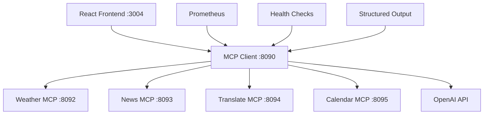

# 🐵 MCP Monkeys - Spring AI 기반 통합 MCP 플랫폼

> **Model Context Protocol (MCP)** 아키텍처로 구현된 차세대 AI 통합 서비스 플랫폼  
> **Spring AI 1.0.1** 완전 적용으로 최신 AI 기능 구현

[](https://spring.io/projects/spring-ai)
[](https://kotlinlang.org/)
[](https://spring.io/projects/spring-boot)

## 🎯 프로젝트 개요

MCP Monkeys는 **Model Context Protocol (MCP)** 아키텍처를 기반으로 한 통합 AI 서비스 플랫폼입니다. Spring AI 1.0.1의 최신 기능들을 완전히 활용하여 구조화된 출력, 관찰 가능성, 그리고 확장 가능한 마이크로서비스 아키텍처를 제공합니다.

### ✨ 핵심 특징

- **🏗️ 진짜 MCP 아키텍처**: 각 서비스를 독립적인 MCP 서버로 분리
- **🤖 Spring AI 1.0.1 완전 활용**: ChatClient Builder, Structured Output, Observability
- **📊 실시간 모니터링**: Prometheus 메트릭, OpenTelemetry 추적
- **🎨 React 친화적**: 완전한 CORS 지원, RESTful API
- **🔧 확장 가능**: 새로운 MCP 서버 추가 용이
- **🛡️ 타입 안전**: Kotlin + Configuration Properties

## 🏗️ 아키텍처



### 🎭 서비스 구성

| 서비스 | 포트 | 역할 | 상태 |
|--------|------|------|------|
| **MCP Client** | 8090 | 통합 관리자 + AI 인터페이스 | ✅ 완료 |
| **Weather Server** | 8092 | 날씨 정보 서비스 | ✅ 완료 |
| **News Server** | 8093 | 뉴스 검색 서비스 | ✅ 완료 |
| **Translate Server** | 8094 | 번역 서비스 | ✅ 완료 |
| **Calendar Server** | 8095 | 일정 관리 서비스 | ✅ 완료 |
| **React Frontend** | 3004 | 사용자 인터페이스 | ✅ 완료 |

## 🚀 빠른 시작

### 1️⃣ 환경 설정

```bash
# 필수 환경 변수 설정
export OPENAI_API_KEY="your-openai-api-key"

# 선택적 API 키 (더 풍부한 기능을 위해)
export WEATHER_API_KEY="your-openweathermap-key"  
export NEWS_API_KEY="your-newsapi-key"
export GITHUB_TOKEN="your-github-token"
export JIRA_TOKEN="your-jira-token"
```

### 2️⃣ 서버 실행

```bash
# 🔥 원클릭 실행 - 모든 MCP 서버 동시 시작
./gradlew :mcp-weather-server:bootRun --args='--server.port=8092' &
./gradlew :mcp-news-server:bootRun --args='--server.port=8093' &
./gradlew :mcp-translate-server:bootRun --args='--server.port=8094' &
./gradlew :mcp-calendar-server:bootRun --args='--server.port=8095' &

# 통합 클라이언트 실행 
./gradlew :mcp-client:bootRun --args='--server.port=8090'
```

### 3️⃣ 프론트엔드 실행

```bash
cd mcp-front
npm install
npm run dev
# 브라우저에서 http://localhost:3004 접속
```

### 4️⃣ 시스템 검증

```bash
# 🧪 통합 테스트 실행
chmod +x simple-test.sh
./simple-test.sh

# 또는 수동 검증
curl http://localhost:8090/api/health/mcp-servers
curl http://localhost:8090/actuator/prometheus
```

## 🛠️ Spring AI 1.0.1 핵심 기능

### 🎨 ChatClient Builder 패턴

```kotlin
@Bean
fun chatClient(chatModel: OpenAiChatModel): ChatClient {
    return ChatClient.builder(chatModel)
        .defaultSystem("""
            당신은 MCP Monkeys의 통합 AI 어시스턴트입니다.
            사용 가능한 서비스들:
            - 🌤️ Weather: 날씨 정보 조회
            - 📰 News: 뉴스 검색 및 조회  
            - 🌐 Translate: 텍스트 번역
            - 📅 Calendar: 일정 관리
        """.trimIndent())
        .build()
}
```

### 📋 Structured Output (BeanOutputConverter)

```kotlin
data class WeatherResponse(
    @JsonProperty("weather") 
    @JsonPropertyDescription("현재 날씨 상태")
    val weather: String,
    
    @JsonProperty("temperature")
    @JsonPropertyDescription("현재 온도 (섭씨)")  
    val temperature: Double,
    
    @JsonProperty("location")
    @JsonPropertyDescription("위치 정보")
    val location: String
)

// 사용 예시
val converter = BeanOutputConverter(WeatherResponse::class.java)
val structuredResponse = chatClient.prompt()
    .user("서울 날씨 알려줘\n\n${converter.format}")
    .call()
    .entity(WeatherResponse::class.java)
```

### 📊 Observability & Monitoring

```yaml
management:
  endpoints:
    web:
      exposure:
        include: health,info,metrics,prometheus,env
  metrics:
    export:
      prometheus:
        enabled: true
    distribution:
      percentiles-histogram:
        http.server.requests: true
        mcp.chat.duration: true
  tracing:
    sampling:
      probability: 1.0
```

### 🏥 Health Checks & Monitoring

```bash
# 전체 시스템 상태
GET /api/health/comprehensive

# MCP 서버 연결 상태
GET /api/health/mcp-servers

# Prometheus 메트릭
GET /actuator/prometheus

# API 상태 확인
GET /api/status
```

## 🎪 API 사용 가이드

### 💬 기본 채팅

```bash
curl -X POST http://localhost:8090/api/chat \
  -H "Content-Type: application/json" \
  -d '{
    "message": "오늘 서울 날씨 어때?",
    "sessionId": "user123"
  }'
```

### 📊 구조화된 응답

```bash
curl -X POST http://localhost:8090/api/chat \
  -H "Content-Type: application/json" \
  -d '{
    "message": "서울 날씨 정보를 JSON으로 알려줘",
    "format": "structured",
    "sessionId": "user123"
  }'
```

### 🌊 스트리밍 채팅

```bash
curl -N http://localhost:8090/api/chat/stream?message=날씨+알려줘
```

### 🔗 복합 서비스 연계

```bash
curl -X POST http://localhost:8090/api/chat \
  -H "Content-Type: application/json" \
  -d '{
    "message": "서울 날씨를 확인하고, 관련 뉴스도 찾아서 영어로 번역해줘"
  }'
```

## 📁 프로젝트 구조

```
mcp-monkeys/
├── 📊 shared/                    # 공통 DTO 및 유틸리티
├── 🌤️ mcp-weather-server/        # 날씨 정보 MCP 서버
├── 📰 mcp-news-server/           # 뉴스 검색 MCP 서버
├── 🌐 mcp-translate-server/      # 번역 MCP 서버
├── 📅 mcp-calendar-server/       # 일정 관리 MCP 서버
├── 🤖 mcp-client/                # 통합 MCP 클라이언트
│   ├── config/                   # Spring AI 설정
│   │   ├── OpenAIConfig.kt      # ChatClient Builder
│   │   ├── ObservabilityConfig.kt # 메트릭 설정
│   │   └── WebClientConfig.kt   # HTTP 클라이언트
│   ├── controller/              # REST API
│   │   ├── UnifiedChatController.kt
│   │   └── HealthController.kt
│   ├── dto/                     # Structured Output DTO
│   └── service/                 # 비즈니스 로직
└── 🎨 mcp-front/                 # React 프론트엔드
```

## 🛠️ 기술 스택

| 카테고리 | 기술 | 버전 |
|----------|------|------|
| **Framework** | Spring Boot | 3.5.4 |
| **Language** | Kotlin | 1.9.25 |
| **AI Integration** | Spring AI | 1.0.1 |
| **LLM Provider** | OpenAI GPT | 4/3.5-turbo |
| **Protocol** | Model Context Protocol | Latest |
| **Database** | H2 Database | In-memory |
| **HTTP Client** | WebFlux + OkHttp | 4.12.0 |
| **Monitoring** | Micrometer + Prometheus | Latest |
| **Tracing** | OpenTelemetry | Latest |
| **Frontend** | React + TypeScript | 18.x |
| **Build Tool** | Gradle | 8.x |

## 🎭 MCP 서버별 기능

### 🌤️ Weather MCP Server (8092)

```kotlin
@Tool("현재 날씨 정보를 조회합니다")
fun getCurrentWeather(
    @Parameter("도시명") city: String,
    @Parameter("국가코드 (선택사항)") country: String? = null
): WeatherInfo

@Tool("날씨 예보를 조회합니다") 
fun getWeatherForecast(
    @Parameter("도시명") city: String,
    @Parameter("예보 일수") days: Int = 5
): ForecastInfo
```

### 📰 News MCP Server (8093)

```kotlin
@Tool("최신 뉴스 헤드라인을 조회합니다")
fun getTopHeadlines(
    @Parameter("국가코드") country: String = "kr",
    @Parameter("카테고리") category: String? = null
): List<NewsArticle>

@Tool("키워드로 뉴스를 검색합니다")
fun searchNews(
    @Parameter("검색 키워드") query: String,
    @Parameter("언어") language: String = "ko"
): List<NewsArticle>
```

### 🌐 Translate MCP Server (8094)

```kotlin
@Tool("텍스트를 번역합니다")
fun translateText(
    @Parameter("번역할 텍스트") text: String,
    @Parameter("소스 언어") sourceLang: String = "auto",
    @Parameter("타겟 언어") targetLang: String
): TranslationResult
```

### 📅 Calendar MCP Server (8095)

```kotlin
@Tool("일정을 생성합니다")
fun createEvent(
    @Parameter("일정 제목") title: String,
    @Parameter("시작 시간") startTime: String,
    @Parameter("종료 시간") endTime: String
): CalendarEvent
```

## 🔧 개발자 가이드

### 🆕 새로운 MCP 서버 추가

1. **서버 생성**
```bash
mkdir mcp-your-service-server
cd mcp-your-service-server
# build.gradle.kts 및 기본 구조 생성
```

2. **서비스 구현**
```kotlin
@Component
class YourMcpService {
    @Tool("서비스 설명")
    fun yourMethod(@Parameter("파라미터 설명") param: String): Result {
        // 구현
    }
}
```

3. **클라이언트 연결 설정**
```yaml
spring:
  ai:
    mcp:
      client:
        connections:
          your-service:
            url: http://localhost:8096
            name: your-service-mcp-server
```

### 🔍 디버깅 & 로그

```yaml
logging:
  level:
    com.monkeys.client: DEBUG
    org.springframework.ai: DEBUG
    org.springframework.ai.mcp: DEBUG
```

### 🧪 테스트

```bash
# 단위 테스트
./gradlew test

# 통합 테스트  
./gradlew integrationTest

# 전체 시스템 검증
./simple-test.sh
```

## 📈 성능 & 모니터링

### 📊 주요 메트릭

- `http.server.requests`: HTTP 요청 지연시간
- `mcp.chat.duration`: MCP 채팅 처리 시간  
- `jvm.memory.used`: JVM 메모리 사용량
- `mcp.server.connections`: MCP 서버 연결 상태

### 🎯 성능 최적화

```yaml
spring:
  webflux:
    multipart:
      max-in-memory-size: 10MB
  r2dbc:
    pool:
      initial-size: 10
      max-size: 20
```

## 🚀 배포 가이드

### 🐳 Docker 컴포즈

```yaml
version: '3.8'
services:
  mcp-weather:
    image: mcp-weather-server:latest
    ports: ["8092:8092"]
  
  mcp-news:  
    image: mcp-news-server:latest
    ports: ["8093:8093"]
    
  mcp-client:
    image: mcp-client:latest  
    ports: ["8090:8090"]
    environment:
      - OPENAI_API_KEY=${OPENAI_API_KEY}
```

### ☁️ 쿠버네티스

```yaml
apiVersion: apps/v1
kind: Deployment
metadata:
  name: mcp-client
spec:
  replicas: 3
  template:
    spec:
      containers:
      - name: mcp-client
        image: mcp-client:latest
        ports:
        - containerPort: 8090
```

## 🎉 사용 사례

### 🌟 실제 사용 예시

1. **날씨 기반 뉴스 검색**
   ```
   "서울 날씨를 확인하고, 날씨와 관련된 최신 뉴스를 찾아서 요약해줘"
   ```

2. **다국어 정보 통합**
   ```  
   "한국 뉴스를 영어로 번역해서 정리해줘"
   ```

3. **일정과 날씨 연동**
   ```
   "내일 회의 일정을 확인하고, 그 시간대 날씨도 알려줘"
   ```

## 🤝 기여 방법

1. Fork the repository
2. Create feature branch (`git checkout -b feature/amazing-feature`)
3. Commit changes (`git commit -m 'Add amazing feature'`)
4. Push to branch (`git push origin feature/amazing-feature`)
5. Open Pull Request

## 📄 라이선스

This project is licensed under the MIT License - see the [LICENSE](LICENSE) file for details.

## 🙋‍♂️ 지원 & 문의

- **GitHub Issues**: [이슈 리포트](https://github.com/VibeMonkeys/mcp-monkeys/issues)
- **문서**: [API 설정 가이드](./API_SETUP.md) | [사용자 가이드](./README_GUIDE.md)
- **이메일**: support@vibemonkeys.com

---

<div align="center">

**🐵 MCP Monkeys - Spring AI로 구현하는 차세대 통합 AI 플랫폼 🐵**

Made with ❤️ by [VibeMonkeys](https://github.com/VibeMonkeys)

</div>