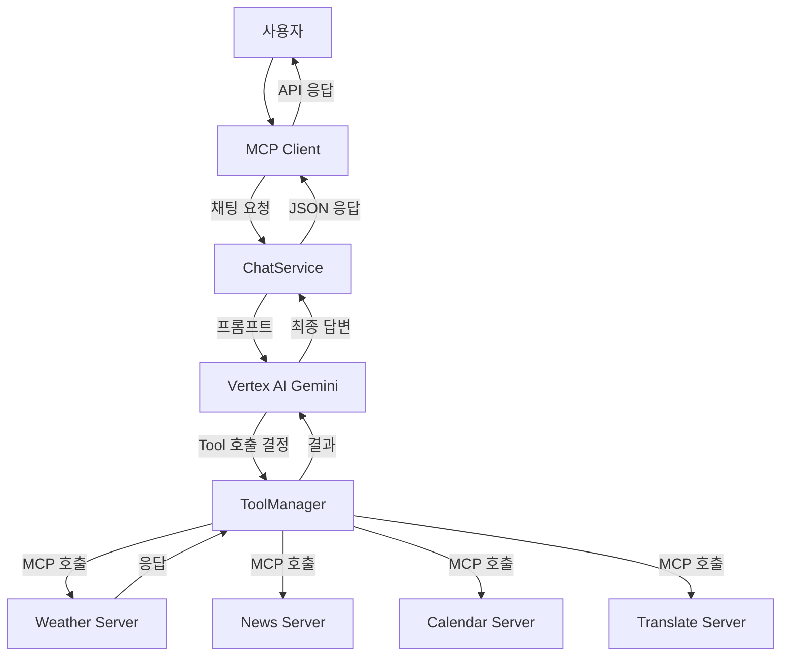

# Spring AI 동작 원리 완전 가이드

## 📋 목차
1. [전체 아키텍처 개요](#전체-아키텍처-개요)
2. [질문 처리 흐름](#질문-처리-흐름)
3. [Tool 등록과 실행](#tool-등록과-실행)
4. [MCP 프로토콜 동작](#mcp-프로토콜-동작)
5. [LLM 의도 분석](#llm-의도-분석)
6. [실제 호출 흐름 예시](#실제-호출-흐름-예시)

---

## 전체 아키텍처 개요



---

## 질문 처리 흐름

### 1. 사용자 요청 → 클라이언트
```http
POST /api/chat
{
  "message": "서울의 현재 날씨를 알려주세요",
  "sessionId": "test-session-001"
}
```

### 2. ChatService → LLM 프롬프트 전송
```kotlin
// ChatService.kt:28
val prompt = buildPrompt(request.message)
val response = chatClient.prompt()
    .user(prompt)
    .call()
    .content()
```

### 3. 생성된 프롬프트
```text
사용자 요청: 서울의 현재 날씨를 알려주세요

요청을 분석하여 적절한 도구를 사용하고 도움이 되는 정보를 제공해주세요.
여러 시스템을 연계해야 하는 경우 순서대로 처리해주세요.
```

---

## Tool 등록과 실행

### Tool 등록 과정

#### 1. Tool Bean 등록 (각 MCP 서버)
```kotlin
// WeatherMcpServerApplication.kt
@Bean
fun weatherTools(weatherMcpService: WeatherMcpService): ToolCallbackProvider {
    return MethodToolCallbackProvider.builder()
        .toolObjects(weatherMcpService)  // @Tool 어노테이션이 있는 메서드들을 자동 스캔
        .build()
}
```

#### 2. Tool 어노테이션
```kotlin
// WeatherMcpService.kt
@Tool(description = "지정된 도시의 현재 날씨 정보를 조회합니다")
fun getCurrentWeather(
    @ToolParam(description = "도시 이름", required = true) city: String,
    @ToolParam(description = "온도 단위") units: String = "metric"
): WeatherResult
```

#### 3. MCP 클라이언트 Tool 등록
```yaml
# application.yml
spring:
  ai:
    mcp:
      client:
        connections:
          weather:
            url: http://localhost:8092
            name: weather-mcp-server
```

### Tool 실행 과정

#### 1. LLM이 Tool 필요성 판단
```json
// LLM 내부 추론 (예시)
{
  "reasoning": "사용자가 '서울의 현재 날씨'를 요청했으므로 weather tool이 필요함",
  "tool_calls": [
    {
      "function": "spring_ai_mcp_client_weather_getCurrentWeather",
      "parameters": {
        "city": "서울",
        "units": "metric"
      }
    }
  ]
}
```

#### 2. ToolManager가 MCP 호출
```kotlin
// DefaultToolCallingManager
// 실제 로그: "Executing tool call: spring_ai_mcp_client_weather_getCurrentWeather"
val result = mcpClient.callTool("getCurrentWeather", parameters)
```

#### 3. MCP 서버에서 Tool 실행
```kotlin
// WeatherMcpService.kt
// 실제 로그: "MCP Tool 호출: getCurrentWeather - city=서울, units=metric"
fun getCurrentWeather(city: String, units: String): WeatherResult {
    return runBlocking { weatherService.getCurrentWeather(city, units) }
}
```

---

## MCP 프로토콜 동작

### 1. 연결 초기화
```
Client → Server: Initialize Request
{
  "protocol": "2024-11-05",
  "capabilities": {...},
  "info": {
    "name": "spring-ai-mcp-client - weather",
    "version": "1.0.0"
  }
}

Server → Client: Initialize Response
{
  "protocol": "2024-11-05",
  "capabilities": {
    "tools": {"listChanged": true}
  },
  "info": {
    "name": "weather-mcp-server",
    "version": "1.0.0"
  }
}
```

### 2. Tool 목록 조회
```
Client → Server: List Tools Request
Server → Client: List Tools Response
{
  "tools": [
    {
      "name": "getCurrentWeather",
      "description": "지정된 도시의 현재 날씨 정보를 조회합니다",
      "inputSchema": {
        "type": "object",
        "properties": {
          "city": {"type": "string", "description": "도시 이름"},
          "units": {"type": "string", "description": "온도 단위"}
        },
        "required": ["city"]
      }
    }
  ]
}
```

### 3. Tool 호출
```
Client → Server: Call Tool Request
{
  "name": "getCurrentWeather",
  "arguments": {
    "city": "서울",
    "units": "metric"
  }
}

Server → Client: Call Tool Response
{
  "content": [
    {
      "type": "text",
      "text": "{\"temperature\": 22.5, \"condition\": \"맑음\", ...}"
    }
  ]
}
```

---

## LLM 의도 분석

### 질문: "의도 분석은 Client에서 하나요, LLM이 하나요?"

**답: LLM(Vertex AI Gemini)이 모든 의도 분석을 담당합니다.**

### 1. Client의 역할 (단순 라우팅)
```kotlin
// ChatService.kt - Client는 단순히 LLM에게 전달만 함
fun generateChatResponse(request: ChatRequest): ChatResponse {
    val prompt = buildPrompt(request.message)  // 단순 프롬프트 빌딩
    val response = chatClient.prompt()
        .user(prompt)                          // LLM에게 그대로 전달
        .call()
        .content()
}
```

### 2. LLM의 역할 (지능적 분석)
```
입력: "서울의 현재 날씨를 알려주세요"

LLM 내부 처리:
1. 의도 분석: 사용자가 날씨 정보를 원함
2. 등록된 Tool 목록 확인: getCurrentWeather, getNews, translateText, addEvent... 등
3. Tool 선택: getCurrentWeather가 날씨 정보를 제공할 수 있음을 인식
4. 필요한 정보: 도시(서울), 온도 단위(기본값)
5. 매개변수 추출: city="서울", units="metric"
6. Tool 호출 결정 및 실행
```

### 3. Tool 호출 후 LLM 최종 응답 생성
```
Tool 응답: {"temperature": 22.5, "condition": "맑음", "humidity": 65}

LLM 최종 응답:
"서울의 현재 날씨는 다음과 같습니다:
- 온도: 22.5°C
- 날씨: 맑음  
- 습도: 65%
오늘은 날씨가 좋네요!"
```

---

## 실제 호출 흐름 예시

### 로그 기반 실제 동작 분석

#### 1. 사용자 요청
```
2025-09-11T14:23:34.301+09:00 INFO c.m.c.controller.UnifiedChatController : 통합 채팅 요청: format=text
2025-09-11T14:23:34.301+09:00 INFO com.monkeys.client.service.ChatService : 채팅 요청 처리: message=서울의 현재 날씨를 알려주세요, sessionId=test-session-001
```

#### 2. LLM Tool 호출 결정
```
2025-09-11T14:23:36.885+09:00 DEBUG o.s.a.m.tool.DefaultToolCallingManager : Executing tool call: spring_ai_mcp_client_weather_getCurrentWeather
```

#### 3. MCP 서버에서 Tool 실행
```
2025-09-11T14:23:36.922+09:00 INFO c.m.weather.service.WeatherMcpService : MCP Tool 호출: getCurrentWeather - city=서울, units=metric
2025-09-11T14:23:36.944+09:00 INFO c.m.weather.service.WeatherService : 날씨 조회 요청: city=서울, units=metric
```

---

## 핵심 포인트 정리

### ✅ Tool 호출 확인됨
- **실제 Tool이 호출되고 있음**: 로그에서 `MCP Tool 호출: getCurrentWeather` 확인
- **MCP 통신 정상**: Client ↔ Weather Server 간 MCP 프로토콜 동작

### ✅ 의도 분석 담당자
- **LLM이 모든 의도 분석 담당**: Vertex AI Gemini가 사용자 질문을 분석하고 적절한 Tool 선택
- **Client는 단순 중계**: 프롬프트를 LLM에 전달하고 결과를 반환하는 역할만

### ✅ 자동화된 Tool 선택
- **키워드 기반 규칙 없음**: "날씨"라는 단어가 있어서 Weather Tool을 호출하는 것이 아님
- **LLM 지능적 판단**: 문맥을 이해하고 의도를 파악해서 적절한 Tool 선택
- **동적 Tool 매칭**: LLM이 사용자 질문을 분석 → 등록된 Tool 목록에서 적합한 Tool 자동 탐지 → 매개변수 추출 후 호출

### ✅ 확장 가능한 아키텍처
- **새로운 Tool 추가 시**: MCP 서버만 추가하면 자동으로 LLM이 인식하고 사용
- **복잡한 질문 처리**: "내일 날씨 보고 일정 잡아줘" → Weather + Calendar Tool 연계 호출 가능

---

## LLM Tool 선택 메커니즘 상세

### 🔍 Tool 탐지 과정
1. **Tool 목록 인식**: LLM이 시작 시 등록된 모든 Tool과 각 Tool의 description을 인식
2. **의도 매칭**: 사용자 질문의 의도와 Tool description을 비교하여 적합성 판단
3. **매개변수 분석**: 필요한 Tool을 찾으면 질문에서 매개변수 추출
4. **Tool 호출**: 추출한 매개변수로 해당 Tool 실행

### 📋 예시: 다양한 질문 패턴
```
"서울 날씨 어때?" → getCurrentWeather Tool 선택
"최신 뉴스 보여줘" → getNews Tool 선택  
"내일 회의 일정 잡아줘" → addEvent Tool 선택
"Hello를 한국어로 번역해줘" → translateText Tool 선택
"오늘 날씨 보고 야외 일정 추가해줘" → getCurrentWeather + addEvent 연계 호출
```

### 🎯 핵심 특징
- **NO 하드코딩**: "날씨" 키워드를 찾아서 Weather Tool을 호출하는 것이 아님
- **의미론적 매칭**: LLM이 질문의 의미를 이해하고 적절한 Tool을 지능적으로 선택
- **자동 확장**: 새로운 Tool 추가 시 별도 설정 없이 LLM이 자동으로 인식하고 활용

---

## 결론

Spring AI + MCP 아키텍처는 **LLM의 지능적 판단**을 기반으로 하는 **완전 자동화된 도구 선택 시스템**입니다. 개발자는 단순히 Tool을 등록하기만 하면, LLM이 알아서 상황에 맞는 Tool을 선택하고 호출하여 사용자에게 적절한 답변을 제공합니다.