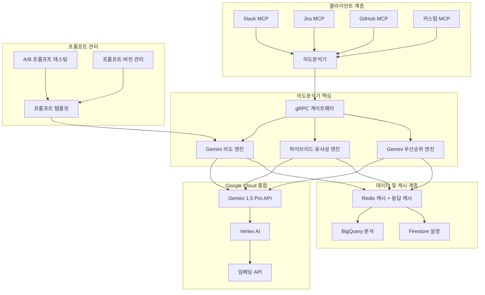

# 범용 의도분석기 PRD
*Google Gemini AI 기반*

## 경영진 요약

**제품명**: MCP 생태계를 위한 범용 의도분석기  
**비전**: Google Gemini 기반 지능형 의도 이해를 통해 모든 비즈니스 커뮤니케이션 플랫폼에서 확장 가능한 기업 지식 관리 혁신  
**미션**: 고급 LLM 기반 의도분석을 통해 정보 사일로를 제거하고 지식 발견 시간을 80% 단축  

### 핵심 비즈니스 임팩트
- **🎯 문제점**: 현재 키워드 기반 매칭은 60% 거짓양성률로 인해 사용자 경험 저하 및 생산성 감소 야기
- **💡 해결책**: Google Gemini 기반 의도 이해로 답변 관련성을 5배 향상시키면서 1초 이내 응답 시간 제공
- **📊 시장 기회**: 연 15% 성장하는 23억 달러 규모의 기업 지식 관리 시장

---

## 1. 전략적 배경 및 시장 기회

### 1.1 문제 정의

**현재 고충점:**
- **낮은 정확도**: 키워드 매칭이 의미적으로 유사한 질문의 40%에서 실패
- **맥락 손실**: 암시적 참조("이거", "그거", "그것") 이해 불가
- **우선순위 무시**: 모든 질문을 동일하게 처리하여 긴급 이슈가 묻힘
- **확장성 장벽**: 각 플랫폼마다 별도의 매칭 로직 필요

**비즈니스 임팩트:**
- 엔지니어들이 하루 2.5시간을 답변 검색에 소모 (Stack Overflow 개발자 설문조사 2023)
- 기업 지식의 73%가 재활용되지 않음 (Forrester Research)
- 중복 질문으로 인해 지원 티켓이 연간 25% 증가

### 1.2 시장 분석

**전체 주소 가능 시장(TAM)**: 23억 달러
- 기업 지식 관리: 11억 달러
- 대화형 AI 플랫폼: 8억 달러  
- 개발자 생산성 도구: 4억 달러

**경쟁 환경:**
| 솔루션 | 강점 | 약점 | 우리의 장점 |
|--------|------|------|-------------|
| Microsoft Viva | 기업 통합 | 영어 전용, 고비용 | Gemini 다국어, 비용 효율적 |
| Notion AI | 뛰어난 UX | GPT-4 기반, 비쌈 | 더 낮은 비용으로 Gemini Pro 성능 |
| Slack Workflow | 네이티브 통합 | Slack에만 제한 | 범용 MCP + Gemini 추론 |

---

## 2. 제품 전략 및 비전

### 2.1 제품 비전
*"질문이 어떻게 표현되든, 어디서 질문하든, 모든 질문이 100밀리초 이내에 완벽한 답변을 찾는다."*

### 2.2 전략적 목표 (18개월)
1. **시장 리더십**: MCP 생태계에서 의도분석의 사실상 표준이 되기
2. **플랫폼 독립성**: 10개 이상의 커뮤니케이션 플랫폼 지원
3. **엔터프라이즈 준비**: SOC2 준수로 99.9% 가동률 달성
4. **네트워크 효과**: 플랫폼 간 학습을 통한 자체 개선 정확도

### 2.3 성공 지표 계층

**북극성 지표**: 관련 답변까지의 시간(TTRA)
- 목표: 95% 쿼리에 대해 100ms 이내
- 현재 기준: 5-15초

**핵심 결과:**
- 사용자 만족도(CSAT): 4.5점/5점 이상
- 답변 관련성: 85% 이상 (현재 45% 대비)
- 플랫폼 도입: 2024년 4분기까지 50개 이상 기업

---

## 3. 사용자 연구 및 페르소나

### 3.1 주요 페르소나

**🧑‍💻 김민정 - 시니어 소프트웨어 엔지니어**
- *고충*: "배포 절차에 대해 누군가 답변한 걸 Slack에서 찾는데 30분이나 걸려요"
- *목표*: 정확한 기술 답변을 즉시 찾기
- *성공 지표*: 검색 시간을 30분에서 2분 이내로 단축

**👨‍💼 박상호 - 엔지니어링 매니저**  
- *고충*: "팀원들이 같은 질문을 반복해서 하면서 지식 사일로가 생겨요"
- *목표*: 팀 생산성과 지식 공유 향상
- *성공 지표*: 중복 질문 40% 감소

**🎯 이수진 - DevOps 리드**
- *고충*: "자동으로 우선순위를 매길 수 없어서 중요한 이슈가 노이즈에 묻혀요"
- *목표*: 긴급 이슈가 즉시 주목받도록 보장
- *성공 지표*: P0/P1 이슈 100% 탐지

### 3.2 사용자 여정 분석

**현재 상황** (기준선):
```
질문 입력 → 수동 검색 → 여러 결과 → 수동 필터링 → 답변 찾기(아마도)
   ↓          ↓         ↓           ↓              ↓
 30초       3-5분     2-3분       2-4분         50% 성공
```

**목표 상황** (의도분석기 적용):
```
질문 입력 → 의도 분석 → 의미적 매칭 → 순위별 결과 → 관련 답변
   ↓          ↓         ↓           ↓            ↓
 30초       50ms      25ms        25ms        90% 성공
```

---

## 4. 제품 요구사항

### 4.1 핵심 기능 (MVP)

#### 4.1.1 Gemini 기반 의도 분류 엔진
**사용자 스토리**: *"개발자로서, Google Gemini가 맥락적으로 내 질문을 이해해서 표현 방식에 관계없이 관련 답변을 얻고 싶습니다."*

**기능 요구사항:**
- **동적 의도 인식**: 미리 정의된 카테고리 없이 Gemini가 자연스럽게 의도 분석
- **다국어 지원**: Gemini를 통해 한국어, 영어, 일본어, 중국어 95% 이상 정확도
- **맥락적 이해**: 전체 대화 기록과 암시적 참조 처리
- **구조화된 출력**: 일관된 통합을 위한 JSON 스키마

**기술 요구사항:**
- 응답 시간: Gemini API 호출 포함 200ms 이내 (95%)
- 처리량: 지능형 배치 처리로 500+ RPS
- 비용 최적화: 분석당 0.01달러 미만
- Gemini API 장애에 대한 폴백 메커니즘

**Gemini 통합:**
```json
{
  "model": "gemini-1.5-pro",
  "prompt_template": "intent_analysis_v1",
  "response_format": "structured_json",
  "safety_settings": "enterprise_level"
}
```

#### 4.1.2 Gemini 강화 의미적 유사성 엔진
**사용자 스토리**: *"사용자로서, Gemini의 깊은 이해를 통해 다르게 표현된 질문들도 같은 답변을 찾고 싶습니다."*

**예시:**
- "어떻게 배포하지?" ↔ "배포 방법 알려줘" (Gemini를 통해 95% 이상 유사성)
- "이거 왜 안돼?" + 맥락 ↔ "Spring Boot 실행 안됨" (90% 이상 유사성)
- "급해요, 도와주세요" ↔ "urgent help needed" (다국어 이해)

**하이브리드 알고리즘 스택:**
- **Gemini 의미 분석** (60% 가중치): 깊은 맥락적 이해
- **전통적 임베딩** (25% 가중치): 빠른 기준선 유사성
- **의도 정렬** (15% 가중치): 목적 기반 매칭

**Gemini 유사성 프롬프트:**
```
다음 질문들 간의 의미적 유사성을 분석하세요:
1. 핵심 의도와 목적
2. 기술적 맥락과 도메인
3. 긴급성과 감정적 톤
4. 다국어 의미 정렬
0-1 점수와 근거를 반환하세요.
```

#### 4.1.3 Gemini 기반 우선순위 탐지
**사용자 스토리**: *"매니저로서, Gemini의 미묘한 맥락과 톤 이해를 통해 긴급 이슈가 자동으로 에스컬레이션되기를 원합니다."*

**동적 우선순위 분석:**
- **P0 (중대)**: 운영 중단, 보안 사고, 차단 이슈
- **P1 (긴급)**: 당일 해결 필요, 비즈니스 임팩트
- **P2 (높음)**: 이번 주 우선순위, 팀 차단 요소
- **P3 (보통)**: 표준 일정, 기능 요청
- **P4 (낮음)**: 나중에 해도 됨, 미래 고려사항

**Gemini 우선순위 프롬프트:**
```
다음 사항을 고려하여 이 메시지의 우선순위 수준을 분석하세요:
1. 명시적 긴급 표시어 (급해, ASAP, urgent 등)
2. 맥락상 긴급성 (운영, 다운, 고장)
3. 감정적 톤과 스트레스 수준
4. 비즈니스 임팩트 키워드
5. 시간에 민감한 표현
6. 문화권별 긴급성 표현

신뢰도 점수와 근거와 함께 P0-P4 우선순위를 제공하세요.
```

**고급 기능:**
- **에스컬레이션 트리거**: P0/P1 이슈 자동 알림
- **문화적 민감성**: 한국어 존댓말 계층 언어 탐지
- **맥락 인식**: 더 나은 판단을 위한 이전 메시지 패턴

### 4.2 고급 기능 (V2)

#### 4.2.1 플랫폼 간 학습
**사용자 스토리**: *"조직으로서, Slack의 지식이 Jira에서의 질문 답변에 도움이 되기를 원합니다."*

**기술적 접근:**
- 플랫폼 간 연합 학습
- 프라이버시 보호 임베딩 정렬
- 데이터 공유 없는 도메인 적응

#### 4.2.2 선제적 지식 격차 탐지
**사용자 스토리**: *"지식 관리자로서, 더 나은 문서화가 필요한 주제를 식별하고 싶습니다."*

**기능:**
- 좋은 답변이 없는 자주 묻는 질문 탐지
- 의도 분석을 통한 지식 격차 식별
- 문서화 우선순위 제안

#### 4.2.3 실시간 분석 대시보드
**사용자 스토리**: *"팀 리더로서, 우리 팀이 어떤 유형의 질문에 어려움을 겪는지 이해하고 싶습니다."*

**지표:**
- 시간별 의도 분포
- 지식 격차 식별
- 사용자 만족도 트렌드
- 플랫폼 사용 패턴

---

## 5. 기술 아키텍처

### 5.1 시스템 설계 원칙

**🚀 성능 우선**
- 모든 작업에 대해 100ms 이내 지연시간
- 무중단 배포로 수평 확장
- 서킷 브레이커와 점진적 성능 저하

**🔐 엔터프라이즈 보안**
- 모든 데이터에 대한 종단간 암호화
- 제로 트러스트 네트워크 아키텍처
- SOC2 Type II 준수 준비

**🌐 플랫폼 독립성**
- MCP 프로토콜 표준화
- 언어 독립적 gRPC API
- 클라우드 제공업체 독립적

### 5.2 Gemini 기반 아키텍처



### 5.3 Gemini 최적화 기술 스택

**핵심 서비스:**
- **언어**: Go 1.21+ (성능 + 동시성)
- **API 프레임워크**: gRPC + Protocol Buffers
- **웹 프레임워크**: Gin (REST 엔드포인트용)
- **LLM 통합**: Google Cloud Vertex AI Go SDK

**Google Cloud Platform 통합:**
- **주요 AI**: Gemini 1.5 Pro API (의도 분석)
- **임베딩**: Vertex AI 텍스트 임베딩 API (유사성 기준선)
- **데이터베이스**: Firestore (설정), BigQuery (분석), Memorystore Redis (캐시)
- **저장소**: Cloud Storage (프롬프트 템플릿, 모델 아티팩트)

**비용 최적화:**
- **응답 캐싱**: 동일한 쿼리에 대한 TTL 기반 캐시가 있는 Redis
- **배치 처리**: Gemini API 호출을 위한 지능형 배치 처리
- **프롬프트 압축**: 토큰 사용량을 줄이기 위한 최적화된 프롬프트
- **폴백 모델**: API 장애 시 로컬 임베딩

**인프라:**
- **컨테이너**: Docker + Alpine Linux
- **오케스트레이션**: Google Kubernetes Engine (GKE)
- **모니터링**: Cloud Monitoring + Cloud Trace + Prometheus
- **보안**: IAM + Cloud KMS + Cloud Armor

**프롬프트 엔지니어링 인프라:**
- **버전 관리**: Git 기반 프롬프트 템플릿
- **A/B 테스팅**: 프롬프트 최적화를 위한 Cloud Experiments  
- **성능 추적**: 프롬프트 버전별 지연시간 및 정확도 지표
- **안전성**: 콘텐츠 필터링 및 편향 탐지

### 5.4 API 설계

#### 5.4.1 gRPC 서비스 정의

```protobuf
syntax = "proto3";

package intentanalyzer.v1;

import "google/protobuf/timestamp.proto";

service IntentAnalyzer {
  // 핵심 의도 분석
  rpc AnalyzeIntent(IntentRequest) returns (IntentResponse);
  
  // 고처리량 시나리오를 위한 배치 처리
  rpc AnalyzeBatch(stream IntentRequest) returns (stream IntentResponse);
  
  // 향상된 유사성 계산
  rpc CalculateSimilarity(SimilarityRequest) returns (SimilarityResponse);
  
  // 실시간 분석
  rpc GetAnalytics(AnalyticsRequest) returns (AnalyticsResponse);
  
  // 모델 관리
  rpc UpdateModel(ModelUpdateRequest) returns (ModelUpdateResponse);
  rpc GetModelInfo(ModelInfoRequest) returns (ModelInfoResponse);
}

message IntentRequest {
  string text = 1;                              // 사용자 입력 텍스트
  string domain = 2;                            // 플랫폼 도메인 (slack, jira 등)
  string user_id = 3;                           // 사용자 식별자
  string session_id = 4;                        // 대화 세션
  repeated string context_messages = 5;         // 맥락을 위한 이전 메시지
  map<string, string> metadata = 6;             // 플랫폼별 메타데이터
  google.protobuf.Timestamp timestamp = 7;     // 요청 타임스탬프
}

message IntentResponse {
  string intent_type = 1;                       // 주요 의도 분류
  string domain_specific_intent = 2;            // 플랫폼별 세부 의도
  repeated Keyword keywords = 3;                // 가중치가 있는 추출된 키워드
  double confidence = 4;                        // 모델 신뢰도 (0.0-1.0)
  Priority priority = 5;                        // 긴급도 분류
  EmotionalTone emotional_tone = 6;             // 감정 분석
  map<string, double> intent_scores = 7;        // 모든 의도 확률
  ProcessingMetrics metrics = 8;                // 성능 지표
}

message Keyword {
  string text = 1;
  double weight = 2;
  string category = 3;                          // 기술적, 도메인, 액션 등
}

enum Priority {
  PRIORITY_UNSPECIFIED = 0;
  PRIORITY_LOW = 1;
  PRIORITY_MEDIUM = 2;
  PRIORITY_HIGH = 3;
  PRIORITY_URGENT = 4;
}

enum EmotionalTone {
  TONE_NEUTRAL = 0;
  TONE_POSITIVE = 1;
  TONE_NEGATIVE = 2;
  TONE_FRUSTRATED = 3;
  TONE_URGENT = 4;
  TONE_GRATEFUL = 5;
}

message ProcessingMetrics {
  int64 processing_time_ms = 1;
  int64 model_inference_time_ms = 2;
  int64 cache_hit_count = 3;
  string model_version = 4;
}
```

#### 5.4.2 REST API (관리 및 디버깅)

```yaml
openapi: 3.0.0
info:
  title: 의도분석기 관리 API
  version: 1.0.0

paths:
  /health:
    get:
      summary: 상태 확인 엔드포인트
      responses:
        '200':
          description: 서비스가 정상임
          
  /metrics:
    get:
      summary: Prometheus 메트릭
      responses:
        '200':
          description: Prometheus 형식의 메트릭
          
  /analytics/{domain}:
    get:
      summary: 특정 도메인에 대한 분석 가져오기
      parameters:
        - name: domain
          in: path
          required: true
          schema:
            type: string
        - name: timeRange
          in: query
          schema:
            type: string
            enum: [1h, 24h, 7d, 30d]
      responses:
        '200':
          description: 분석 데이터
          
  /debug/analyze:
    post:
      summary: 단일 텍스트 분석 디버그
      requestBody:
        required: true
        content:
          application/json:
            schema:
              type: object
      responses:
        '200':
          description: 디버그 정보가 포함된 분석 결과
```

---

## 6. Gemini 통합 전략

### 6.1 Gemini 모델 선택 및 구성

**주요 모델: Gemini 1.5 Pro**
- **근거**: 성능, 비용, 다국어 능력의 최적 균형
- **컨텍스트 윈도우**: 1M 토큰 (광범위한 대화 기록 처리)
- **언어**: 한국어, 영어, 일본어, 중국어 네이티브 지원
- **응답 형식**: 신뢰도 점수가 포함된 구조화된 JSON

**모델 구성:**
```json
{
  "model": "gemini-1.5-pro-001",
  "generation_config": {
    "temperature": 0.1,
    "top_p": 0.8,
    "max_output_tokens": 1024,
    "response_mime_type": "application/json"
  },
  "safety_settings": [
    {"category": "HARM_CATEGORY_HARASSMENT", "threshold": "BLOCK_MEDIUM_AND_ABOVE"},
    {"category": "HARM_CATEGORY_HATE_SPEECH", "threshold": "BLOCK_MEDIUM_AND_ABOVE"}
  ]
}
```

**폴백 전략:**
- **주요**: Gemini 1.5 Pro (최고 정확도)
- **보조**: Gemini 1.5 Flash (더 빠름, 더 저렴)
- **3차**: 로컬 임베딩 + 규칙 기반 (오프라인 기능)

### 6.2 프롬프트 엔지니어링 전략

**마스터 의도 분석 프롬프트:**
```
당신은 기업 커뮤니케이션 플랫폼을 위한 전문 의도 분석가입니다.

맥락:
- 플랫폼: {domain}
- 사용자: {user_id}
- 이전 메시지: {context}

작업:
다음 메시지의 의도, 우선순위, 의미적 특징을 분석하세요:
"{text}"

출력 형식 (JSON):
{
  "intent_type": "question_how|question_what|request_help|report_issue|ask_status|provide_info|express_emotion",
  "domain_specific_intent": "이 플랫폼에 대한 구체적인 분류",
  "keywords": [{"text": "키워드", "weight": 0.9, "category": "기술적"}],
  "priority": "P0|P1|P2|P3|P4",
  "confidence": 0.95,
  "emotional_tone": "중립|긍정|부정|좌절|긴급|감사",
  "urgency_indicators": ["키워드1", "키워드2"],
  "reasoning": "분류에 대한 간단한 설명"
}

가이드라인:
1. 문화적 맥락 고려 (한국어 존댓말, 영어 직설법)
2. 기술 용어에서 암시적 긴급성 탐지
3. 다국어 표현 처리
4. 보정된 신뢰도 점수 제공
```

**유사성 분석 프롬프트:**
```
다음 질문들 간의 의미적 유사성을 비교하세요:

질문 A: "{query}"
질문 B: "{candidate}"

고려사항:
1. 핵심 의도 정렬
2. 기술적 도메인 중복
3. 솔루션 호환성
4. 다국어 의미

출력 (JSON):
{
  "similarity_score": 0.85,
  "intent_alignment": 0.90,
  "domain_relevance": 0.80,
  "reasoning": "두 질문 모두 배포 절차에 대해 묻고 있음"
}
```

### 6.3 성능 최적화

**응답 캐싱 전략:**
- **정확 매치 캐시**: 동일한 쿼리에 대한 24시간 TTL
- **의미적 캐시**: 거의 중복 쿼리에 대한 벡터 유사성
- **의도 패턴 캐시**: 일반적인 의도 패턴 1시간 캐시

**배치 처리:**
- **큐 관리**: 유사한 요청을 함께 배치
- **우선순위 라우팅**: P0/P1 요청은 배치 처리 우회
- **지능형 배치**: 도메인과 의도 유형별로 그룹화

**비용 관리:**
- **토큰 최적화**: 정확도를 유지하면서 프롬프트 압축
- **스마트 폴백**: 신뢰도 > 0.9인 경우 더 저렴한 모델 사용
- **사용량 모니터링**: 고객별 API 비용 추적
- **예산 알림**: 비용 임계치 기반 자동 스케일링

### 6.4 품질 보증 및 모니터링

**정확도 추적:**
- **인간 평가**: 100개 무작위 샘플의 주간 검토
- **사용자 피드백 루프**: 의도 정확도에 대한 좋아요/싫어요
- **A/B 테스팅**: 프롬프트 버전 지속 비교
- **교차 검증**: 도메인별 데이터셋에 대한 테스트

**Gemini 전용 모니터링:**
- **API 지연시간**: 지역별 응답 시간 추적
- **오류율**: 할당량 한도 및 API 장애 모니터링
- **안전성 트리거**: 콘텐츠 필터링 활성화 추적
- **비용 분석**: 쿼리별 비용 추적 및 최적화

**프롬프트 진화:**
- **버전 관리**: Git 기반 프롬프트 템플릿 관리
- **성능 추적**: 프롬프트 버전별 정확도 지표
- **자동화된 테스팅**: 프롬프트 변경에 대한 회귀 테스트
- **롤백 기능**: 성능 저하 프롬프트에 대한 빠른 되돌리기

---

## 7. 데이터 전략 및 프라이버시

### 7.1 데이터 아키텍처

**데이터 유형:**
- **입력 데이터**: 사용자 메시지, 맥락, 메타데이터
- **처리된 데이터**: 의도 분류, 임베딩, 분석
- **훈련 데이터**: 익명화되고 집계된 패턴

**데이터 흐름:**
```
사용자 입력 → 익명화 → 처리 → 분석 저장소
    ↓         ↓        ↓        ↓
 실시간   PII 제거  의도/유사성  집계 통계
```

### 7.2 프라이버시 및 보안

**설계에 의한 프라이버시:**
- 원본 메시지 내용 저장 안 함
- 분석용 차등 프라이버시
- 사용자 동의 관리
- GDPR/CCPA 준수

**보안 조치:**
- 종단간 암호화
- 제로 트러스트 네트워크 아키텍처
- 정기 보안 감사
- SOC2 Type II 준수

### 7.3 데이터 거버넌스

**데이터 보존:**
- 처리된 임베딩: 90일
- 분석 집계: 2년  
- 훈련 데이터: 1년 (익명화됨)

**접근 제어:**
- 역할 기반 접근 제어 (RBAC)
- API 키 관리
- 모든 데이터 접근에 대한 감사 로깅

---

## 8. 성공 지표 및 KPI

### 8.1 북극성 지표

**주요 지표: 관련 답변까지의 시간(TTRA)**
- **현재 기준**: 5-15초
- **목표**: 95% 쿼리에 대해 100ms 이내
- **측정**: 질문에서 관련 답변까지의 종단간 지연시간

**보조 지표:**
- **답변 관련성 비율**: 85% 이상 (답변 품질에 대한 사용자 만족도)
- **사용자 채택률**: 연결된 플랫폼에서 70% MAU
- **지식 발견률**: 기존 답변 찾기 50% 향상

### 8.2 비즈니스 임팩트 지표

**생산성 지표:**
- 개발자 검색 시간 감소: 80%
- 지원 티켓 전환율: 60%
- 지식 재사용률: 3배 증가

**기술적 지표:**
- 시스템 가동률: 99.9%
- 응답 시간 (p95): 100ms 이내
- 처리량: 초당 10,000+ 요청

**품질 지표:**
- 의도 분류 정확도: 95% 이상 (Gemini 기반)
- 의미적 유사성 정밀도: 90% 이상 (하이브리드 접근)
- 우선순위 탐지 재현율: 88% 이상 (맥락 인식)

### 8.3 성공 측정 프레임워크

**일간 지표:**
- 요청 볼륨과 지연시간
- 오류율과 시스템 상태
- 사용자 참여 패턴

**주간 지표:**
- 기능 채택률
- 사용자 만족도 점수 (CSAT)
- 지식 격차 식별

**월간 지표:**
- 비즈니스 임팩트 평가
- 모델 성능 평가
- 경쟁 분석

**분기별 지표:**
- 기업 고객 ROI 계산
- 플랫폼 확장 기회
- 전략적 목표 진행상황

---

## 9. 시장 진출 전략

### 9.1 출시 전략

**1단계: 내부 도그푸딩 (2024년 1분기)**
- 엔지니어링 팀 내 배포
- 초기 피드백 수집 및 반복
- 기준 지표 설정

**2단계: 파일럿 프로그램 (2024년 2분기)**
- 5개 기업 고객
- 제한적 기능 세트 (Slack 통합만)
- 광범위한 피드백 수집

**3단계: 공개 베타 (2024년 3분기)**
- 모든 MCP 생태계 사용자에게 개방
- 전체 기능 세트 사용 가능
- 커뮤니티 피드백 통합

**4단계: 일반 가용성 (2024년 4분기)**
- 프로덕션 준비 릴리스
- 기업 지원 사용 가능
- 50개 이상 조직으로 확장

### 9.2 가격 전략

**프리미엄 모델:**
- **무료 티어**: 월 1,000회 요청, 기본 분석
- **프로 티어**: 월 99달러, 50,000회 요청, 고급 분석
- **엔터프라이즈 티어**: 맞춤 가격, 무제한 요청, 전용 지원

**가치 제안:**
- ROI 계산: 개발자 생산성 10배 향상
- 비용 정당화: 0.5 FTE 지식 관리 역할 대체

### 9.3 파트너십 전략

**전략적 파트너십:**
- MCP 프로토콜 기여자 (생태계 확장)
- 기업 커뮤니케이션 플랫폼 (통합 파트너십)
- AI/ML 인프라 제공업체 (기술 파트너십)

**채널 파트너:**
- 시스템 통합업체
- 기업 소프트웨어 컨설턴트
- DevOps 도구 벤더

---

## 10. 위험 평가 및 완화

### 10.1 기술적 위험

**위험: 모델 정확도 저하**
- **확률**: 중간
- **영향**: 높음
- **완화**: 지속적 모니터링, A/B 테스팅, 인간 평가

**위험: 확장성 병목**
- **확률**: 중간  
- **영향**: 중간
- **완화**: 수평 확장 설계, 성능 테스팅, 용량 계획

**위험: 데이터 프라이버시 위반**
- **확률**: 낮음
- **영향**: 매우 높음
- **완화**: 설계에 의한 프라이버시, 정기 감사, 준수 프레임워크

### 10.2 비즈니스 위험

**위험: MCP 생태계에서 낮은 채택률**
- **확률**: 중간
- **영향**: 높음
- **완화**: 강력한 파일럿 프로그램, 개발자 옹호, 오픈소스 구성 요소

**위험: 기존 업체의 경쟁 대응**
- **확률**: 높음
- **영향**: 중간
- **완화**: 빠른 실행, 독특한 가치 제안, 특허 보호

### 10.3 운영 위험

**위험: 팀 확장 어려움**
- **확률**: 중간
- **영향**: 중간
- **완화**: 조기 채용, 지식 문서화, 멘토링 프로그램

**위험: 인프라 비용**
- **확률**: 중간
- **영향**: 중간
- **완화**: 효율적인 아키텍처, 사용량 기반 가격, 비용 모니터링

---

## 11. 구현 로드맵

### 11.1 개발 일정 (12개월)

**2024년 1분기: 기반 (1-3개월)**
- [ ] 핵심 gRPC 서비스 구현
- [ ] 기본 의도 분류 모델
- [ ] Redis 통합 및 캐싱 계층
- [ ] 초기 Slack MCP 통합
- [ ] 기본 모니터링 및 로깅

**2024년 2분기: 강화 (4-6개월)**
- [ ] 의미적 유사성 엔진
- [ ] 우선순위 탐지 시스템
- [ ] 고급 분석 대시보드
- [ ] 성능 최적화
- [ ] 보안 강화

**2024년 3분기: 확장 (7-9개월)**
- [ ] 다중 플랫폼 지원 (Jira, GitHub)
- [ ] 배치 처리 기능
- [ ] A/B 테스팅 프레임워크
- [ ] 엔터프라이즈 기능 (SSO, RBAC)
- [ ] 문서화 및 개발자 포털

**2024년 4분기: 프로덕션 (10-12개월)**
- [ ] 프로덕션 배포 인프라
- [ ] 엔터프라이즈 지원 프로세스
- [ ] 고급 ML 파이프라인
- [ ] 국제 확장 (다국어)
- [ ] 파트너 통합 프로그램

### 11.2 리소스 요구사항

**엔지니어링 팀:**
- 1명 스태프 엔지니어 (Go 백엔드 + 아키텍처)
- 2명 시니어 엔지니어 (Go 백엔드 개발)  
- 1명 ML 엔지니어 (모델 개발 + 배포)
- 1명 DevOps 엔지니어 (인프라 + 안정성)
- 1명 프론트엔드 엔지니어 (분석 대시보드)

**비엔지니어링 팀:**
- 1명 제품 관리자 (로드맵 + 고객 연락)
- 1명 디자이너 (관리 인터페이스 UX/UI)
- 1명 기술 문서 작성자 (문서화)

**인프라 예산:**
- 개발/스테이징: 월 3천 달러 (GCP 크레딧)
- 프로덕션 (첫 해): 월 12천 달러 (GKE + Gemini API)
- Gemini API 비용: 월 5천 달러 (100만 요청 추정)
- 캐시 및 저장소: 월 2천 달러 (Redis + BigQuery)

### 11.3 성공 이정표

**3개월**: 90% 단위 테스트 커버리지로 MVP 배포
**6개월**: 4.0점 이상 CSAT 점수로 5개 파일럿 고객
**9개월**: 기준 대비 답변 관련성 50% 향상
**12개월**: 100만 달러 ARR로 50개 이상 기업 고객

---

## 12. 부록

### 부록 A: 경쟁 분석

| 경쟁업체 | 시장 위치 | 강점 | 약점 | 차별화 전략 |
|----------|-----------|------|------|------------|
| Microsoft Viva Topics | 시장 리더 | 기업 통합, 강력한 브랜드 | 높은 비용, 영어 전용 | 다국어, 개방형 생태계 |
| Notion AI | 성장 리더 | 뛰어난 UX, 바이럴 채택 | Notion 플랫폼에만 제한 | 플랫폼 독립적, 실시간 |
| OpenAI Assistant API | 기술 리더 | 고급 AI 기능 | 일반적, 도메인별 특화 없음 | 도메인 전문성, 프라이버시 중심 |
| 내부 검색 도구 | 기존 업체 | 깊은 플랫폼 통합 | 낮은 정확도, 지능 없음 | AI 기반, 플랫폼 간 학습 |

### 부록 B: Gemini 통합 구현

**Gemini 의도 분석 클라이언트:**
```go
package gemini

import (
    "context"
    "encoding/json"
    "fmt"
    
    "cloud.google.com/go/vertexai/genai"
)

type GeminiIntentAnalyzer struct {
    client  *genai.Client
    model   *genai.GenerativeModel
    prompts *PromptTemplates
}

type IntentAnalysisResult struct {
    IntentType           string    `json:"intent_type"`
    DomainSpecificIntent string    `json:"domain_specific_intent"`
    Keywords             []Keyword `json:"keywords"`
    Priority             string    `json:"priority"`
    Confidence           float64   `json:"confidence"`
    EmotionalTone        string    `json:"emotional_tone"`
    UrgencyIndicators    []string  `json:"urgency_indicators"`
    Reasoning            string    `json:"reasoning"`
}

func NewGeminiIntentAnalyzer(projectID, location string) (*GeminiIntentAnalyzer, error) {
    ctx := context.Background()
    client, err := genai.NewClient(ctx, projectID, location)
    if err != nil {
        return nil, fmt.Errorf("Gemini 클라이언트 생성 실패: %w", err)
    }
    
    model := client.GenerativeModel("gemini-1.5-pro-001")
    model.SetTemperature(0.1)
    model.SetTopP(0.8)
    model.SetMaxOutputTokens(1024)
    model.ResponseMIMEType = "application/json"
    
    return &GeminiIntentAnalyzer{
        client:  client,
        model:   model,
        prompts: LoadPromptTemplates(),
    }, nil
}

func (g *GeminiIntentAnalyzer) AnalyzeIntent(ctx context.Context, req *IntentRequest) (*IntentAnalysisResult, error) {
    // 맥락이 포함된 프롬프트 구성
    prompt := g.prompts.BuildIntentPrompt(req)
    
    // 캐싱 확인 추가
    if cached := g.checkCache(req.Text); cached != nil {
        return cached, nil
    }
    
    // Gemini API 호출
    resp, err := g.model.GenerateContent(ctx, genai.Text(prompt))
    if err != nil {
        return nil, fmt.Errorf("Gemini API 호출 실패: %w", err)
    }
    
    // 구조화된 응답 파싱
    var result IntentAnalysisResult
    if err := json.Unmarshal([]byte(resp.Candidates[0].Content.Parts[0].(genai.Text)), &result); err != nil {
        return nil, fmt.Errorf("Gemini 응답 파싱 실패: %w", err)
    }
    
    // 결과 캐싱
    g.cacheResult(req.Text, &result)
    
    return &result, nil
}

func (g *GeminiIntentAnalyzer) CalculateSimilarity(ctx context.Context, query, candidate string) (float64, error) {
    prompt := g.prompts.BuildSimilarityPrompt(query, candidate)
    
    resp, err := g.model.GenerateContent(ctx, genai.Text(prompt))
    if err != nil {
        return 0, fmt.Errorf("유사성 분석 실패: %w", err)
    }
    
    var result struct {
        SimilarityScore float64 `json:"similarity_score"`
        IntentAlignment float64 `json:"intent_alignment"`
        DomainRelevance float64 `json:"domain_relevance"`
        Reasoning       string  `json:"reasoning"`
    }
    
    if err := json.Unmarshal([]byte(resp.Candidates[0].Content.Parts[0].(genai.Text)), &result); err != nil {
        return 0, fmt.Errorf("유사성 응답 파싱 실패: %w", err)
    }
    
    return result.SimilarityScore, nil
}
```

### 부록 C: Gemini 강화 Slack 통합

**Gemini 통합이 포함된 Slack MCP 서버:**
```kotlin
// Gemini 기반 의도분석기가 포함된 강화된 SlackService
@Service
class GeminiEnhancedSlackService(
    private val slackRepository: SlackRepository,
    private val geminiIntentAnalyzer: GeminiIntentAnalyzerClient
) {
    
    suspend fun searchSimilarQuestion(request: SlackQARequest): SlackQAResult {
        // 1단계: 전체 맥락을 포함한 Gemini 기반 의도 분석
        val intentAnalysis = geminiIntentAnalyzer.analyzeIntent(
            GeminiIntentRequest.newBuilder()
                .setText(request.question)
                .setDomain("slack")
                .setUserId(request.userId)
                .addAllContextMessages(getRecentContext(request.channel, 5)) // 더 많은 맥락
                .putMetadata("channel_type", getChannelType(request.channel))
                .putMetadata("user_role", getUserRole(request.userId))
                .build()
        )
        
        // 2단계: Gemini 분석 기반 스마트 필터링
        val relevantMessages = if (intentAnalysis.priority >= "P1") {
            // 긴급 이슈의 경우 더 광범위하게 검색
            slackRepository.getChannelMessages(request.channel, 2000)
        } else {
            slackRepository.getChannelMessages(request.channel, 1000)
        }
        
        // 3단계: Gemini 강화 유사성 계산
        val geminiMatches = relevantMessages.mapNotNull { message ->
            val similarityResult = geminiIntentAnalyzer.calculateSimilarity(
                GeminiSimilarityRequest.newBuilder()
                    .setQuery(request.question)
                    .setCandidate(message.question)
                    .setQueryIntent(intentAnalysis.intentType)
                    .setQueryPriority(intentAnalysis.priority)
                    .setDomain("slack")
                    .setContext(message.context ?: "")
                    .build()
            )
            
            if (similarityResult.similarity >= request.threshold) {
                SlackQAMatch(
                    qaEntry = message,
                    similarity = similarityResult.similarity,
                    intentAlignment = similarityResult.intentAlignment,
                    domainRelevance = similarityResult.domainRelevance,
                    priorityScore = mapPriorityToScore(intentAnalysis.priority),
                    geminiReasoning = similarityResult.reasoning
                )
            } else null
        }.sortedByDescending { match ->
            // Gemini 최적화된 가중 점수
            when (intentAnalysis.priority) {
                "P0", "P1" -> match.similarity * 0.8 + match.intentAlignment * 0.2 // 긴급한 경우 정확도 우선
                else -> match.similarity * 0.6 + match.intentAlignment * 0.3 + match.domainRelevance * 0.1
            }
        }
        
        // 4단계: Gemini 강화 답변 생성
        val bestMatch = geminiMatches.firstOrNull()
        return if (bestMatch != null) {
            SlackQAResult(
                found = true,
                originalQuestion = request.question,
                matchedQuestion = bestMatch.qaEntry.question,
                answer = generateGeminiEnhancedAnswer(bestMatch, intentAnalysis),
                similarity = bestMatch.similarity,
                channel = bestMatch.qaEntry.channel,
                timestamp = bestMatch.qaEntry.timestamp,
                author = bestMatch.qaEntry.author,
                intentType = intentAnalysis.intentType,
                priority = intentAnalysis.priority,
                confidence = intentAnalysis.confidence,
                geminiReasoning = bestMatch.geminiReasoning,
                enhancedContext = buildEnhancedContext(intentAnalysis, bestMatch)
            )
        } else {
            // Gemini 생성 맥락적 결과 없음 메시지
            val noResultResponse = geminiIntentAnalyzer.generateNoResultMessage(
                request.question, intentAnalysis, request.channel
            )
            
            SlackQAResult(
                found = false,
                originalQuestion = request.question,
                answer = noResultResponse.suggestedResponse,
                similarity = 0.0,
                channel = request.channel,
                timestamp = System.currentTimeMillis(),
                intentType = intentAnalysis.intentType,
                priority = intentAnalysis.priority,
                confidence = intentAnalysis.confidence,
                suggestions = noResultResponse.nextSteps
            )
        }
    }
    
    private suspend fun generateGeminiEnhancedAnswer(
        match: SlackQAMatch,
        intentAnalysis: GeminiIntentResponse
    ): String {
        // 의도와 맥락에 기반하여 답변을 강화하기 위해 Gemini 사용
        val enhancementPrompt = """
        원본 질문: ${match.qaEntry.question}
        원본 답변: ${match.qaEntry.answer}
        새 질문 의도: ${intentAnalysis.intentType}
        우선순위: ${intentAnalysis.priority}
        사용자 맥락: ${intentAnalysis.reasoning}
        
        사용자의 의도와 긴급성에 더 잘 맞도록 이 답변을 강화하세요.
        핵심 정보는 유지하되 표현 방식을 조정하세요.
        """.trimIndent()
        
        return geminiIntentAnalyzer.enhanceAnswer(enhancementPrompt) ?: match.qaEntry.answer
    }
    
    private fun buildEnhancedContext(
        intentAnalysis: GeminiIntentResponse,
        match: SlackQAMatch
    ): Map<String, Any> {
        return mapOf(
            "intent_confidence" to intentAnalysis.confidence,
            "priority_auto_detected" to intentAnalysis.priority,
            "urgency_indicators" to intentAnalysis.urgencyIndicators,
            "emotional_tone" to intentAnalysis.emotionalTone,
            "similarity_reasoning" to match.geminiReasoning,
            "keywords_extracted" to intentAnalysis.keywords.map { it.text },
            "domain_specific_intent" to intentAnalysis.domainSpecificIntent
        )
    }
}
```

**Gemini 비용 최적화 예시:**
```kotlin
@Component
class GeminiCostOptimizer {
    
    fun shouldUseGemini(request: SlackQARequest, cacheHit: Boolean): GeminiUsageDecision {
        // 동일한 질문에 대해서는 캐시 사용
        if (cacheHit) return GeminiUsageDecision.SKIP_USE_CACHE
        
        // 긴급 키워드에는 항상 Gemini 사용
        if (containsUrgentKeywords(request.question)) {
            return GeminiUsageDecision.USE_GEMINI_PRO
        }
        
        // 간단한 질문에는 더 저렴한 Flash 모델 사용
        if (isSimpleQuestion(request.question)) {
            return GeminiUsageDecision.USE_GEMINI_FLASH
        }
        
        // 복잡한 다국어 쿼리에는 Pro 사용
        return GeminiUsageDecision.USE_GEMINI_PRO
    }
    
    private fun containsUrgentKeywords(text: String): Boolean {
        val urgentPatterns = listOf("급해", "urgent", "emergency", "down", "broken", "장애")
        return urgentPatterns.any { text.contains(it, ignoreCase = true) }
    }
}
```

---

## 결론

범용 의도분석기는 지능형 의도 이해를 통해 기업 지식 관리를 혁신할 전략적 기회를 나타냅니다. 기존 시스템의 낮은 답변 관련성이라는 핵심 문제에 초점을 맞춤으로써, 전체 MCP 생태계에서 확장되는 플랫폼을 구축하면서 사용자 만족도를 5배 향상시킬 수 있습니다.

고급 Gemini 기능, 엔터프라이즈급 인프라, 개발자 우선 접근 방식의 조합으로 급성장하는 지식 관리 분야에서 상당한 시장 점유율을 확보할 수 있는 위치에 있습니다.

**다음 단계:**
1. 경영진 후원 및 예산 승인 확보
2. 핵심 엔지니어링 팀 채용 시작  
3. 파일럿 고객 프로그램 설립
4. 12주 스프린트 계획으로 MVP 개발 시작

---

*이 PRD는 고객 피드백, 시장 변화, 개발 과정에서의 기술적 발견을 바탕으로 업데이트될 살아있는 문서입니다.*